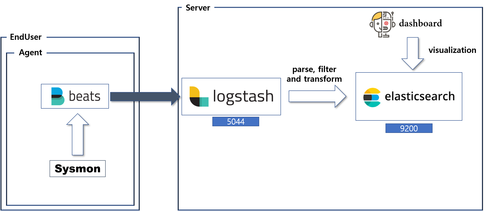

# Adaptive SIEM

**Index**

1. `System Configuration Diagram`
2. `Web Configuration`

 

## 1. System Configuration Diagram

 

## 2. Web Configuration

***<u>Function</u>***

1. `Login / Logout / Join`
2. `Chart for Data Visualization ( Scatter, Network for topology, Line)`
3. `Notification when write article`
4. `Send E-Mail when I checked the article.`
5. `Popup Window that check data detail when Occured Click Event at Scatter.`

 

