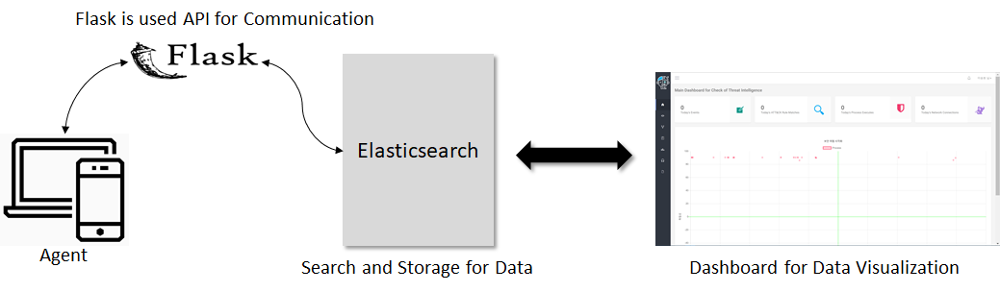

# Best of The Best Project

**Index**

1. `System Configuration Diagram`
2. `Web Configuration`

## 1. System Configuration Diagram

## 2. Web Configuration

**Language:** `JSP&Servlet / Javascript / HTML5&CSS3`

**Container:** `Apache Tomcat 9`

**Web Server:** `Apache`

**DB:** `MySQL 5.7`

**Configuration:** `Eclipse` 

***<u>Function</u>***

1. Login / Logout / Join
2. Chart for Data Visualization ( Scatter, Network for topology, Line)
3. Notification when write article
4. Send E-Mail when I checked the article.
5. Popup Window that check data detail when Occured Click Event at Scatter.
6. Etc

> It was really fun.
>
> Thanks a lot